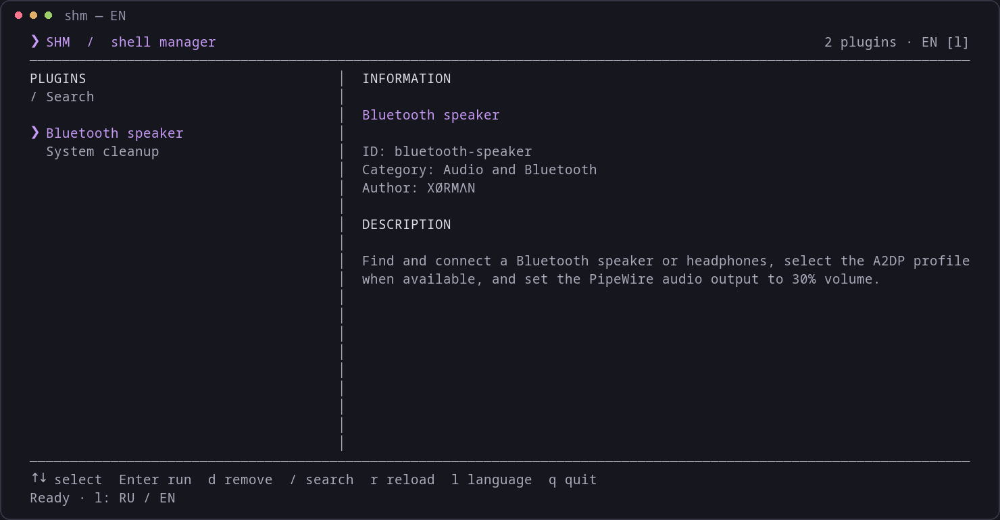

# SHM — Shell Script Manager

[](https://github.com/George-Salt/shm/releases/latest)
[](https://github.com/George-Salt/shm/actions/workflows/ci.yml)
[](LICENSE)


[Russian documentation](README.ru.md) · [Contributing](CONTRIBUTING.md) · [Security](SECURITY.md)

SHM is a lightweight terminal application for organizing, inspecting, running, and removing local Bash script plugins on Linux. It provides a fullscreen Python interface and a command-line interface. The interface, command-line messages, and bundled plugins support English and Russian. Language preferences persist between sessions.



## Features

- Searchable plugin list with keyboard and mouse navigation.
- Plugin metadata, configurable script entry points, and argument forwarding through the CLI.
- Embedded execution view with a pseudo-terminal (PTY) for output and interactive prompts.
- Confirmation before plugin removal or replacement.
- User-local installation and configurable data directory.
- Standard-library-only Python implementation; no pip dependencies.

## Requirements

Linux, Bash 4.4 or newer, Python 3.8 or newer, and standard GNU utilities. The fullscreen interface requires an interactive terminal with ANSI escape sequence support and a UTF-8 locale. Git is needed only to clone the repository. Individual plugins may require additional tools.

## Installation

### Install release v0.1.0

Download and extract the release archive, then run the included installer:

```bash
curl -fLO https://github.com/George-Salt/shm/releases/download/v0.1.0/shm-0.1.0.tar.gz
tar -xzf shm-0.1.0.tar.gz
cd shm-0.1.0
bash install.sh
```

The release includes `SHA256SUMS` for verifying the downloaded archive. Git is not required to install a release. The installer asks whether to add bundled plugins.

### Install from source

```bash
git clone https://github.com/George-Salt/shm.git
cd shm
bash install.sh
```

The launcher is installed to `~/.local/bin/shm`. Add this directory to your shell's PATH if necessary:

```bash
# Bash or Zsh: add to ~/.bashrc or ~/.zshrc
export PATH="$HOME/.local/bin:$PATH"

# Fish
fish_add_path ~/.local/bin
```

Start a new shell, then run `shm`. The installer asks whether to install bundled plugins. Non-interactive installation skips them. Re-running the installer updates application files and leaves installed plugins in place, apart from a legacy migration that removes the old `alice` plugin when it matches the installer’s signature.

## Usage

```bash
shm                         # Open the fullscreen interface
shm list                    # List installed plugins
shm info cleanup            # Inspect metadata
shm run cleanup             # Run a plugin
shm run my-plugin arg1 arg2  # Forward arguments to its script
shm remove my-plugin        # Remove after confirmation
shm help                    # Show command help
```

`shm run` returns the plugin's exit status. Use the CLI for non-interactive terminals and scripts.

| Control | Action |
| --- | --- |
| Up / Down or k / j | Select a plugin |
| Page Up / Page Down, Home / End | Navigate the list |
| Enter | Run the selected plugin |
| / | Search; Enter applies, Esc cancels |
| d or Delete | Request removal with confirmation |
| r | Reload plugins |
| l | Switch English / Russian and save the preference |
| q or Esc | Exit |
| Mouse | Click to select, double-click to run, wheel to scroll |

The execution view forwards input to the running plugin. After completion, Enter, q, or Esc returns to the list. Programs requiring their own fullscreen terminal interface should be run through `shm run <id>`.

## Plugins

Plugins live in `<SHM_HOME>/plugins/<id>/`. Each directory contains `plugin.conf` and a Bash entry script (default: `main.sh`). Install a local plugin with:

```bash
bash "${SHM_HOME:-${XDG_DATA_HOME:-$HOME/.local/share}/shm}/plugin-install.sh" ./plugins/cleanup
```

See the [plugin authoring guide](docs/plugins.md) for the format and a minimal example. Plugins execute with your user's permissions and are not sandboxed. Review a script before installing or running it.

### Bundled plugins

| ID | Purpose | Dependencies |
| --- | --- | --- |
| cleanup | Clean package caches, user caches, trash, and old journal entries on Arch Linux and derivatives | GNU utilities; `sudo`, `paccache` from pacman-contrib; optional `gio` and `journalctl` |
| bluetooth-speaker | Pair/connect a Bluetooth device, select an audio output, and set volume to 30% | BlueZ `bluetoothctl`, PipeWire/WirePlumber `wpctl`; optional `pactl` for A2DP selection |

Cleanup requests confirmation before deleting data; package cache and journal operations use sudo. Bluetooth discovery lists known devices as well as discovered devices; users choose the intended audio device. Hardware and service configuration affect results.

## Language

Press `l` in the plugin list to switch languages immediately, or use:

```bash
shm lang en             # Save English as the default
shm lang ru             # Save Russian as the default
shm lang                # Show the effective language
SHM_LANG=en shm         # Override for a single launch
shm --version           # Show the installed version
```

Selection order: `SHM_LANG`, saved preference in `<SHM_HOME>/language`, then `LC_ALL`, `LC_MESSAGES`, or `LANG`. Russian locales select Russian; other locales and unsupported explicit language values use English. A switch in the UI saves the new preference and overrides the current process's environment value. Bundled plugins inherit this language. Third-party plugins need their own translations; output from external system tools follows those tools' locale support.

## Configuration and appearance

| Variable | Meaning |
| --- | --- |
| SHM_LANG | Language override: en or ru |
| SHM_HOME | Override application and plugin data location |
| XDG_DATA_HOME | Data base directory when SHM_HOME is unset; defaults to ~/.local/share |
| NO_COLOR | A nonempty value disables CLI color formatting |

Use the same environment settings during installation and execution. The launcher always installs to `~/.local/bin`. The default data location is `~/.local/share/shm`.

The interface uses the terminal's ANSI palette (ANSI 5 for accent) and default background. It does not change the terminal palette using OSC commands and does not use curses. NO_COLOR currently applies to the Bash CLI, not the fullscreen interface.

## Updating and uninstalling

Update the checkout with `git pull --ff-only`, then run `bash install.sh` again. Bundled plugin updates require opting in and confirming replacement.

To uninstall, remove `~/.local/bin/shm` and the SHM data directory. The data directory also contains installed plugins and their files: back up anything needed first. For custom installations, use the actual SHM_HOME location.

## Development

Run `bash tests/smoke.sh` for syntax checks and isolated installation/CLI checks. GitHub Actions runs the same checks on pushes and pull requests with Python 3.8 and 3.12. CI also exercises language switching and plugin execution through a real PTY with an inert fixture. Visual behavior, audio hardware, and destructive cleanup actions still require manual testing.

Translation source: `translations.json`; regenerate the Bash catalog with `python3 tools/build_catalog.py` after edits. To recreate the README screenshots, install the optional development dependencies Pillow and pyte and run `python3 tools/capture_screenshot.py`. They are not required by SHM. With a clean committed checkout, `bash tools/build_release.sh` produces a release archive and checksums in `dist/`.

See [CONTRIBUTING.md](CONTRIBUTING.md), [SECURITY.md](SECURITY.md), and [CHANGELOG.md](CHANGELOG.md). SHM is distributed under the [MIT license](LICENSE).
