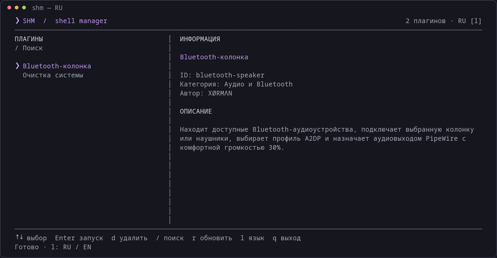

# SHM — менеджер shell-скриптов

[](https://github.com/George-Salt/shm/releases/latest)
[](https://github.com/George-Salt/shm/actions/workflows/ci.yml)
[](LICENSE)


[English documentation](README.md) · [Участие в разработке](CONTRIBUTING.md) · [Безопасность](SECURITY.md)

SHM — компактное терминальное приложение для организации, просмотра, запуска и удаления локальных плагинов на Bash в Linux. Проект предоставляет полноэкранный интерфейс на Python и интерфейс командной строки. Интерфейс, сообщения командной строки и встроенные плагины поддерживают русский и английский язык. Выбранный язык сохраняется между запусками.



## Возможности

- Список плагинов с поиском, управлением с клавиатуры и мышью.
- Метаданные плагинов, настройка точки входа и передача аргументов через CLI.
- Экран выполнения с псевдотерминалом (PTY) для вывода и интерактивных запросов.
- Подтверждение удаления и замены плагинов.
- Установка в каталог пользователя и настройка расположения данных.
- Использование только стандартной библиотеки Python, без зависимостей pip.

## Требования

Linux, Bash версии 4.4 или новее, Python версии 3.8 или новее и стандартные утилиты GNU. Полноэкранному интерфейсу необходим интерактивный терминал с поддержкой ANSI и локаль UTF-8. Git требуется только для клонирования репозитория. Дополнительные зависимости определяются конкретным плагином.

## Установка

### Установка релиза v0.1.0

Скачайте и распакуйте архив релиза, затем запустите установщик:

```bash
curl -fLO https://github.com/George-Salt/shm/releases/download/v0.1.0/shm-0.1.0.tar.gz
tar -xzf shm-0.1.0.tar.gz
cd shm-0.1.0
bash install.sh
```

В релизе доступен файл `SHA256SUMS` для проверки скачанного архива. Для установки релиза Git не требуется. Установщик предложит добавить встроенные плагины.

### Установка из исходников

```bash
git clone https://github.com/George-Salt/shm.git
cd shm
bash install.sh
```

Команда устанавливается в `~/.local/bin/shm`. При необходимости добавьте каталог в PATH:

```bash
# Bash или Zsh: добавьте в ~/.bashrc или ~/.zshrc
export PATH="$HOME/.local/bin:$PATH"

# Fish
fish_add_path ~/.local/bin
```

Откройте новую оболочку и выполните `shm`. Установщик запрашивает согласие на установку встроенных плагинов. При неинтерактивном запуске они пропускаются. Повторная установка обновляет файлы приложения и сохраняет плагины, кроме миграции старого плагина `alice`, если он соответствует сигнатуре в установщике.

## Использование

```bash
shm                         # Полноэкранный интерфейс
shm list                    # Список плагинов
shm info cleanup            # Информация о плагине
shm run cleanup             # Запуск
shm run my-plugin arg1 arg2  # Передача аргументов скрипту
shm remove my-plugin        # Удаление с подтверждением
shm help                    # Справка
```

`shm run` возвращает код завершения плагина. Для автоматизации и неинтерактивных терминалов используйте CLI.

| Клавиша | Действие |
| --- | --- |
| Стрелки вверх / вниз или k / j | Выбор плагина |
| Page Up / Page Down, Home / End | Навигация по списку |
| Enter | Запуск выбранного плагина |
| / | Поиск; Enter применяет, Esc отменяет |
| d или Delete | Удаление с подтверждением |
| r | Обновление списка |
| l | Переключение русского / английского с сохранением выбора |
| q или Esc | Выход |
| Мышь | Выбор кликом, запуск двойным кликом, прокрутка колесом |

Во время выполнения ввод передаётся плагину. После завершения Enter, q или Esc возвращает к списку. Программы с собственным полноэкранным интерфейсом запускайте через `shm run <id>`.

## Плагины

Каталог плагинов: `<SHM_HOME>/plugins/<id>/`. Каждый плагин содержит `plugin.conf` и Bash-скрипт, по умолчанию `main.sh`. Установка из локального каталога:

```bash
bash "${SHM_HOME:-${XDG_DATA_HOME:-$HOME/.local/share}/shm}/plugin-install.sh" ./plugins/cleanup
```

Формат и минимальный пример приведены в [руководстве по созданию плагинов](docs/plugins.ru.md). Плагины работают с правами вашего пользователя без изоляции. Перед установкой и запуском ознакомьтесь с содержимым скрипта.

### Встроенные плагины

| ID | Назначение | Зависимости |
| --- | --- | --- |
| cleanup | Очистка кэша пакетов, пользовательского кэша, корзины и старых журналов в Arch Linux и производных | Утилиты GNU; sudo, paccache из pacman-contrib; опционально gio и journalctl |
| bluetooth-speaker | Подключение Bluetooth-устройства, выбор аудиовыхода и установка громкости 30% | bluetoothctl из BlueZ, wpctl из PipeWire/WirePlumber; опционально pactl для выбора A2DP |

Очистка требует подтверждения удаления; операции с кэшем пакетов и системным журналом используют sudo. Bluetooth-плагин показывает известные и обнаруженные устройства: нужное аудиоустройство выбирает пользователь. Результат зависит от оборудования и настройки служб.

## Язык

Нажмите `l` в списке плагинов для немедленного переключения языка или используйте CLI:

```bash
shm lang ru             # Сохранить русский язык по умолчанию
shm lang en             # Сохранить английский язык по умолчанию
shm lang                # Показать действующий язык
SHM_LANG=en shm         # Переопределить язык для одного запуска
shm --version           # Показать установленную версию
```

Приоритет: `SHM_LANG`, сохранённый выбор в `<SHM_HOME>/language`, затем `LC_ALL`, `LC_MESSAGES` или `LANG`. Русская локаль выбирает русский; остальные локали и неизвестные значения SHM_LANG — английский. Переключение в интерфейсе сохраняет выбор и переопределяет значение переменной для текущего процесса. Встроенные плагины наследуют язык. Сторонним плагинам нужны собственные переводы; сообщения внешних системных утилит зависят от их поддержки локали.

## Настройка и оформление

| Переменная | Назначение |
| --- | --- |
| SHM_LANG | Переопределение языка: en или ru |
| SHM_HOME | Собственный каталог данных приложения и плагинов |
| XDG_DATA_HOME | Базовый каталог данных, если SHM_HOME не задан; по умолчанию ~/.local/share |
| NO_COLOR | Непустое значение отключает цвета CLI |

При установке и запуске используйте одинаковые значения переменных. Команда всегда устанавливается в `~/.local/bin`. Каталог данных по умолчанию — `~/.local/share/shm`.

Интерфейс использует ANSI-палитру терминала, ANSI 5 для акцента и фон по умолчанию. Приложение не меняет палитру через OSC-команды и не использует curses. NO_COLOR применяется к Bash CLI; полноэкранный интерфейс пока не учитывает эту переменную.

## Обновление и удаление

В каталоге проекта выполните `git pull --ff-only`, затем `bash install.sh`. Обновление встроенных плагинов требует согласия на их установку и подтверждения замены.

Для удаления приложения удалите `~/.local/bin/shm` и каталог данных SHM. В каталоге данных находятся установленные плагины и их файлы: предварительно сохраните нужные данные. Если задан SHM_HOME, используйте фактический путь.

## Разработка

Команда `bash tests/smoke.sh` проверяет синтаксис, установку и CLI в изолированном временном каталоге. GitHub Actions выполняет эти проверки при push и pull request с Python 3.8 и 3.12. CI также проверяет переключение языка и запуск безопасного тестового плагина через настоящий PTY. Внешний вид, аудиооборудование и удаление данных по-прежнему требуют ручного тестирования.

Источник переводов — `translations.json`; после изменения выполните `python3 tools/build_catalog.py`, чтобы обновить Bash-каталог. Для пересоздания скриншотов README установите необязательные зависимости разработки Pillow и pyte и выполните `python3 tools/capture_screenshot.py`. Для работы SHM они не нужны. В чистом закоммиченном проекте команда `bash tools/build_release.sh` создаёт архив релиза и контрольные суммы в `dist/`.

Дополнительные сведения: [CONTRIBUTING.md](CONTRIBUTING.md), [SECURITY.md](SECURITY.md), [CHANGELOG.md](CHANGELOG.md). Проект распространяется по [лицензии MIT](LICENSE).
